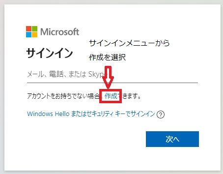
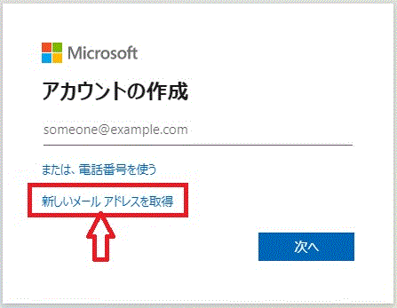

# 都営練馬関町北三丁目アパート自治会　e-mail　アカウント作成
## 目的
1 各種連絡、自治会内情報共有
2 インターネットを介した公共料金、金融、地方自治体等各種公共サービス利用
3 電子的な文書保存

## 具体的な方法
Microsoft outlookの無料アカウントを取得する。  
Step 1: [サインインメニューから __作成__ を選択](https://login.live.com/)  
  
 
Step 2: [アカウントの作成メニューから __新しいメールアドレスを取得__ を選択]  
  
e-mail: sekikita3jichikai@outlook.jp  
password: [[1234aBcD  
姓: 関町北三丁目都営練馬関町北三丁目  
名: アパート自治会  
生年月日：2022/04/10  

## サインイン(Windows PCから)
ブラウザを開き[https://login.live.com/](https://login.live.com/)へ移動。  
sekikita3jichikai@outlook.jp を入力。  
  

パスワード __[[1234aBcD__ を入力。  
  

## くらしTEPCO　登録情報
ログインID: zhxz3zx@tepco  
パスワード: 4567uYtR  
メールアドレス: sekikita3jichikai@outlook.jp  

## くらしTEPCO web 操作
くらしTEPCO web[`(https://www.kurashi.tepco.co.jp/)`](https://www.kurashi.tepco.co.jp/)へ移動。  
  
メールアドレスとパスワードを入力。  
  
「現在表示中のプラン：」の右のリストボックスを選択  
  

以上で説明概要を終わります。
